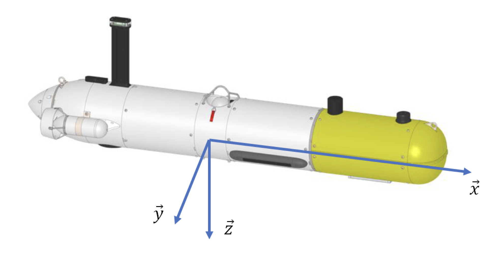
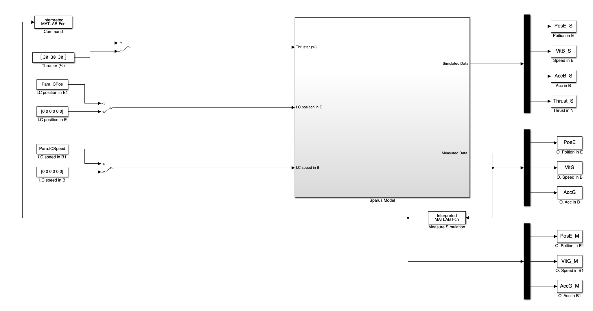
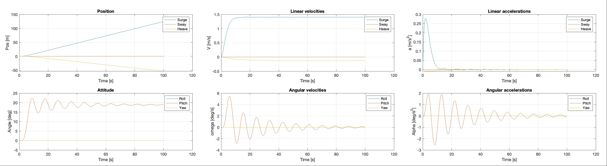
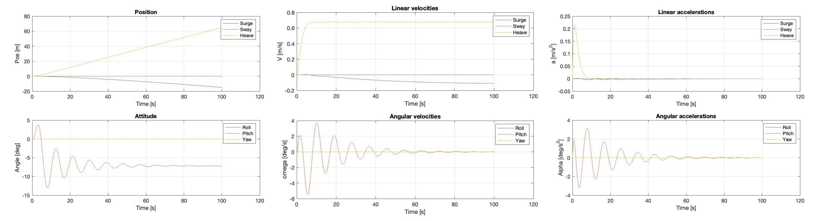
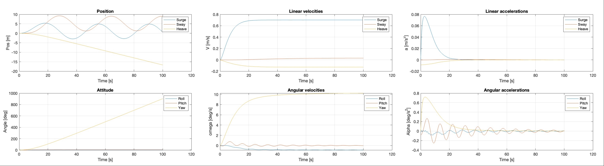

# Modeling and control of underwater vehicle : Sparus 

Objective of this project work is 

1. To estimate all added mass and drag matrices for SPARUS AUV (Main body, Antenna, Thrusters). 
2. Analysing these at CG and CO of the body. 
3. Simulation and validation of these results.

Group Members:

* Abhimanyu Bhowmik
* Madhushree Sannigrahi

<iframe src="https://collaborate.shapr3d.com/v/d_FCLpX64_0JoLZ2hRbQQ" title="Shapr3D Webviewer" width="640" height="640" frameborder="0" allow="web-share; xr-spatial-tracking" loading="lazy" scrolling="no" referrerpolicy="origin-when-cross-origin" allowfullscreen></iframe>

The Sparus AUV

## Results

Fianl added Mass matrix calculated at the center of boyouncy of the AUV. The added Mass consist of added masses of hull, antenna and thrusters. The effects of USBL has been considered non significant.

$$ M_{added}^{CB} = 
\begin{bmatrix}
1.7570 & 0 & 0 & 0 & -0.0226 & 0 \\
0 & 57.6831 & 0 & 1.0735 & 0 & 3.7376 \\
0 & 0 & 59.5259 & 0 & -4.7884 & 0 \\
0 & 1.0735 & 0 & 0.0925 & 0 & 0.0392 \\
-0.0226 & 0 & -4.7884 & 0 & 10.3735 & 0 \\
0 & 3.7376 & 0 & 0.0392 & 0 & 9.7682 \\
\end{bmatrix}
$$

The objective is to calculate the drag matrices for each component of an AUV in its centre of gravity. This involves computing individual drag matrices for each component initially expressed in the component's buoyancy centre and then transferring them to the AUV's centre of gravity. Additionally, the following assumption is used for calcualting drag :

| Sections  | 3D Drag Shape         | 2D Drag Shape       |
|-----------|-----------------------|---------------------|
| Hull      | Ellipsoid (L/D = 8)  | Circular rod (Cylinder) |
| Thrusters | Ellipsoid (L/D = 4)  | Circular rod (Cylinder) |
| Antenna   | -                     | Rectangular rod     |

Final drag matrices for each of the objects:

$$D_{\text{Hull}} =     
\begin{bmatrix}
2.0774 & 0 & 0 & 0 & 0 & 0 \\
0 & 55.2000 & 0 & 0 & 0 & 0 \\
0 & 0 & 55.2000 & 0 & 0 & 0 \\
0 & 0 & 0 & 0 & 0 & 0 \\
0 & 0 & 0 & 0 & 7.0656 & 0 \\
0 & 0 & 0 & 0 & 0 & 7.0656 \\
\end{bmatrix}$$

$$D_{\text{Antenna}} = 
\begin{bmatrix}
6.9041 & 0 & 0 & 0 & 0 & 0 \\
0 & 17.4420 & 0 & 0 & 0 & 0 \\
0 & 0 & 0 & 0 & 0 & 0 \\
0 & 0 & 0 & 0 & 0 & 0 \\
0 & 0 & 0 & 0 & 0.0036 & 0 \\
0 & 0 & 0 & 0 & 0 & 0.0090 \\
\end{bmatrix}$$

$$D_{\text{Thruster}} =     
\begin{bmatrix}
0.1695 & 0 & 0 & 0 & 0 & 0 \\
0 & 2.3159 & 0 & 0 & 0 & 0 \\
0 & 0 & 2.3159 & 0 & 0 & 0 \\
0 & 0 & 0 & 0 & 0 & 0 \\
0 & 0 & 0 & 0 & 0.0009 & 0 \\
0 & 0 & 0 & 0 & 0 & 0.0009 \\
\end{bmatrix}
$$

## Simulation

### Simulation Setup

Simulation Setup in MatLAB

### CASE 1: Surge motion (along x-axis)

Surge motion, a fundamental movement, should exhibit stability during execution. By activating the right and left thrusters at 30\% power in the positive x-axis direction, the craft moved forward.

Simulation Results for Case I

### CASE 2: Heave motion (along z-axis)

During our analysis, heave motion, considered a fundamental movement of the craft, should ideally demonstrate stability during execution. By activating the vertical thruster at 30\% power in the positive z-axis direction, the craft dived into the water.

Simulation Results for Case II

### CASE 3: Yaw motion (around z-axis)

Executing yaw motion, another fundamental movement, should ideally demonstrate stability. By activating the right thruster at 5\% power in the positive x-axis direction and the left thruster at 10\% power, the craft initiates a left turn.

Simulation Results for Case III

